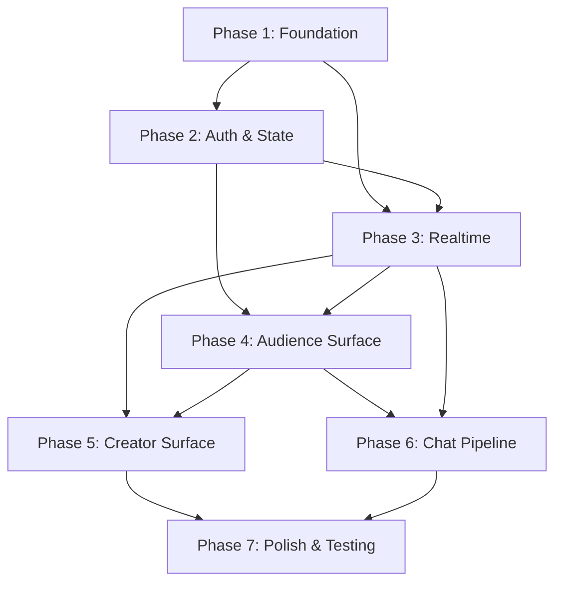

# Creator Stage Frontend — Implementation Plan

Derived from [system-design.md](file:///Users/deepak/TechPix/creator-stage-frontend/docs/system-design.md).

## Architecture Decision: Client-Side Rendered SPA

This app runs **entirely in the browser**. Next.js 16 is used as a build tool and routing framework only — no server runtime dependency.

Key constraints:
- `output: 'export'` — `next build` produces static HTML/CSS/JS in `out/`
- No Server Components, Server Actions, or Route Handlers
- No `rewrites`, `redirects`, or `headers` in Next.js config
- No `cookies()`, `headers()`, `redirect()` server-side imports
- All page components are Client Components (`'use client'`)
- All data fetching via TanStack Query (client-side `fetch`)
- API base URL configured via `NEXT_PUBLIC_API_URL` env var
- WebSocket URL via `NEXT_PUBLIC_WS_URL` env var
- Deployable to any static host (S3, CloudFront, Nginx, Vercel static)

## Current State

- Fresh Next.js 16.2.6 scaffold (React 19, Tailwind v4, TypeScript)
- No application code exists — only default boilerplate in `app/layout.tsx` and `app/page.tsx`
- No dependencies installed beyond Next.js, React, Tailwind, ESLint

## Architecture Summary

Three-role SPA (Audience, Creator, Team-stub) with JWT auth, Centrifuge WebSocket realtime, TanStack Query for server state, Zustand for client state, and a high-throughput chat render pipeline using ring buffers + RAF batching.

---

## Phase 1 — Foundation & Project Setup

**Goal:** Establish project structure, install dependencies, configure tooling, and set up the provider tree.

---

### Task 1.1 — Install Core Dependencies

Install all required packages per the stack table.

**Runtime:**
- `zustand` — client state
- `@tanstack/react-query` — server state
- `centrifuge` — realtime (centrifuge-js)
- `react-hook-form` + `zod` + `@hookform/resolvers` — forms
- `react-virtuoso` — virtualized chat list

**Dev:**
- `vitest` + `@testing-library/react` + `@testing-library/jest-dom` — unit tests
- `msw` — REST mocking for component tests
- `@tanstack/react-query-devtools` — dev tooling

---

### Task 1.2 — TypeScript Strict Mode

Update `tsconfig.json`:
- Enable `noUncheckedIndexedAccess`
- Enable `exactOptionalPropertyTypes`
- Verify `strict: true` already set

---

### Task 1.3 — Scaffold Folder Structure

Create the directory tree from the design doc. All folders with placeholder `index.ts` barrel files where needed:

```
src/
├── auth/
├── realtime/
├── api/
├── features/
│   ├── chat/
│   ├── cta/
│   ├── analytics/
│   └── sessions/
├── lib/
├── stores/
└── test/
```

Map to Next.js App Router under `app/` — all pages are Client Components:
```
app/
├── (public)/
│   ├── login/page.tsx        # 'use client'
│   ├── join/page.tsx         # 'use client'
│   ├── ended/page.tsx        # 'use client'
│   └── error/page.tsx        # 'use client'
├── c/                        # creator routes
│   └── sessions/
│       └── [sessionId]/page.tsx  # 'use client'
├── a/                        # audience routes
│   └── s/
│       └── [sessionId]/page.tsx  # 'use client'
├── layout.tsx                # 'use client' — wraps providers
├── providers.tsx             # 'use client' — provider composition
└── globals.css
```

---

### Task 1.4 — Next.js Config: Static Export & Environment

Configure `next.config.ts`:

```ts
import type { NextConfig } from 'next';

const nextConfig: NextConfig = {
  output: 'export',
};

export default nextConfig;
```

No `rewrites` — API requests go directly to the backend via `NEXT_PUBLIC_API_URL`.

Environment variables (`.env.local` for dev, CI/deployment for prod):
```
NEXT_PUBLIC_API_URL=http://localhost:8080
NEXT_PUBLIC_WS_URL=ws://localhost:8000/connection/websocket
NEXT_PUBLIC_HMAC_KEY=dev-only-key
```

**Dev proxy alternative:** Use Vite's proxy or a local Caddy/Nginx reverse proxy during development if CORS is not configured on the backend. This is outside Next.js config.

---

### Task 1.5 — Design System Base

- Configure Tailwind v4 with project color tokens, typography scale
- Install and configure shadcn/ui (init, add base components: Button, Input, Dialog, Toast, Card)
- Set up light/dark mode via Tailwind `dark:` modifier
- Add Inter font (or keep Geist — confirm with team)

---

### Task 1.6 — Vitest Setup

- Create `vitest.config.ts` with React plugin, path aliases
- Create `src/test/setup.ts` with Testing Library matchers
- Add test scripts to `package.json`

---

## Phase 2 — Auth & State Infrastructure

**Goal:** Implement JWT auth flow, Zustand stores, TanStack Query client, and the provider tree. All client-side — no server-side auth helpers.

---

### Task 2.1 — API Client (`src/api/client.ts`) [x]

Fetch wrapper that:
- Reads base URL from `NEXT_PUBLIC_API_URL` (compile-time inlined)
- Attaches JWT from `useAuthStore` as `Authorization: Bearer` header
- Handles 401 → triggers auth refresh or redirect
- Typed response handling with error discrimination
- No server-side fetch — runs only in browser

---

### Task 2.2 — Auth Store (`src/stores/auth-store.ts`)

Zustand store holding:
- `jwt: string | null`
- `role: 'audience' | 'creator' | 'team' | null`
- `expiry: number | null`
- `refreshTimerHandle: ReturnType<typeof setTimeout> | null`
- Actions: `setToken`, `clearToken`, `scheduleRefresh`
- Persisted to `sessionStorage` (Zustand `persist` middleware with `sessionStorage` adapter)

---

### Task 2.3 — Auth API (`src/api/auth.ts`)

Functions (all client-side fetch to `NEXT_PUBLIC_API_URL`):
- `login(identityToken: string)` → `POST {API_URL}/api/auth/login`
- `getToken(params: { sessionId: string; inviteToken?: string; identityToken?: string })` → `POST {API_URL}/api/auth/token`

---

### Task 2.4 — Auth Provider (`src/components/providers/auth-provider.tsx`)

Client Component (`'use client'`) React context provider:
- On mount, checks `sessionStorage` for cached upstream token
- Implements silent refresh loop: `setTimeout(refresh, exp - now - 60s)`
- Exposes `useAuth()` hook returning `{ jwt, role, isAuthenticated, logout }`
- On refresh failure: client-side redirect via `router.push('/join')` (audience) or `router.push('/login')` (creator)
- No server-side `redirect()` — uses `next/navigation` `useRouter` only

---

### Task 2.5 — Creator Login Page (`app/auth/login/page.tsx`)

`'use client'` component:
- Dev-only HMAC identity_token minter using `NEXT_PUBLIC_HMAC_KEY`
- Form: email/identifier input → generates identity_token → `POST {API_URL}/api/auth/login` → `router.push('/c/sessions')`
- Gated via `process.env.NODE_ENV === 'development'` (compile-time eliminated in prod build)

---

### Task 2.6 — Audience Join Page (`app/auth/join/page.tsx`)

`'use client'` component:
- Reads `session` and `invite` from URL search params via `useSearchParams()`
- Calls `GET {API_URL}/api/sessions/{sid}/status` (public, unauth)
- If ended → `router.push('/ended')`
- If live → `POST {API_URL}/api/auth/token` with invite JWT → store JWT → `router.push('/a/s/{sid}')`
- If 401 → `router.push('/error?reason=invalid_invite')`
- Stores `invite_jwt` in `sessionStorage` keyed by `session_id`

---

### Task 2.7 — Zustand Stores

Create remaining stores:

| Store | File | State |
|---|---|---|
| `useRealtimeStore` | `src/stores/realtime-store.ts` | Connection status enum, per-channel subscription status map |
| `useUIStore` | `src/stores/ui-store.ts` | Layout panel sizes, modal stack, toast queue |
| `useSlowModeStore` | `src/stores/slow-mode-store.ts` | Cooldown deadline keyed by session ID |

---

### Task 2.8 — TanStack Query Setup

- Create `QueryClient` with defaults (staleTime, retry, refetchOnWindowFocus)
- Create `QueryClientProvider` wrapper in `app/providers.tsx`
- Define query key factory: `queryKeys.session(id)`, `queryKeys.chat.recent(id)`, etc.
- All queries use client-side `fetch` to `NEXT_PUBLIC_API_URL`

---

### Task 2.9 — Provider Tree (`app/providers.tsx`)

`'use client'` component composing providers in order:
```
QueryClientProvider → AuthProvider → RealtimeProvider → UIStore → children
```

Wire into `app/layout.tsx` (also `'use client'`).

---

### Task 2.10 — Error & Ended Pages

`'use client'` components:
- `app/(public)/ended/page.tsx` — session ended state
- `app/(public)/error/page.tsx` — reads `reason` from URL via `useSearchParams()`, displays error

---

## Phase 3 — Realtime Infrastructure

**Goal:** Centrifuge client, channel subscriptions, and the `useRealtimeBackedQuery` pattern. All browser-side.

---

### Task 3.1 — Channel Constants (`src/realtime/channels.ts`)

```ts
export const channels = {
  chat:      (sid: string) => `session:${sid}:chat`,
  activity:  (sid: string) => `session:${sid}:activity`,
  analytics: (sid: string) => `session:${sid}:analytics`,
} as const;
```

---

### Task 3.2 — Centrifuge Client Singleton (`src/realtime/centrifuge-client.ts`)

- Creates one `Centrifuge` instance per app lifecycle
- Connects to `NEXT_PUBLIC_WS_URL`
- Accepts JWT for connection token
- Exposes `connect()`, `disconnect()`, `getClient()`
- Relies on Centrifuge's built-in exponential backoff for reconnection
- Loaded via `next/dynamic` with `ssr: false` if Centrifuge accesses browser globals at import time

---

### Task 3.3 — Realtime Provider (`src/realtime/realtime-provider.tsx`)

`'use client'` component:
- Creates Centrifuge instance when session-scoped JWT is available
- Updates `useRealtimeStore` with connection status
- Disconnects on unmount or auth change
- Reconnect banner: only shows after disconnect exceeds 2 seconds

---

### Task 3.4 — `useChannel` Hook (`src/realtime/use-channel.ts`)

- Subscribes to a named channel via the Centrifuge instance
- Handles subscription errors (role mismatch → `denied` status, no retry)
- Updates per-channel status in `useRealtimeStore`
- Returns typed subscription for message handling
- Auto-resubscribes on reconnect

---

### Task 3.5 — `useRealtimeBackedQuery` Hook (`src/realtime/use-realtime-backed-query.ts`)

The standard recovery pattern:
- Wraps a TanStack Query query + a Centrifuge subscription
- On WS message → writes into query cache via `queryClient.setQueryData`
- On reconnect → refetches the query (REST recovery via client-side fetch)
- Components read only from `useQuery` — never directly from WS

---

## Phase 4 — Audience Surface

**Goal:** Build the full audience experience — YouTube player, live chat, pinned banner, CTA card.

---

### Task 4.1 — Session API (`src/api/sessions.ts`)

All requests to `NEXT_PUBLIC_API_URL`:
- `getSessionStatus(sid: string)` → `GET {API_URL}/api/sessions/{sid}/status` (public)
- `getSession(sid: string)` → `GET {API_URL}/api/sessions/{sid}` (authed)

---

### Task 4.2 — Chat API (`src/api/chat.ts`)

- `getChatRecent(sid: string)` → `GET {API_URL}/api/sessions/{sid}/chat/recent` (returns `{ messages, pinned_message, active_cta }`)
- `sendMessage(sid: string, body: string)` → `POST {API_URL}/api/sessions/{sid}/chat`
- `pinMessage(sid: string, messageId: string)` → `POST {API_URL}/api/sessions/{sid}/chat/pin`
- `unpinMessage(sid: string)` → `DELETE {API_URL}/api/sessions/{sid}/chat/pin`

---

### Task 4.3 — CTA API (`src/api/cta.ts`)

- `pushCTA(sid: string, data: { label: string; url: string })` → `POST {API_URL}/api/sessions/{sid}/cta`
- `dismissCTA(sid: string)` → `DELETE {API_URL}/api/sessions/{sid}/cta`

---

### Task 4.4 — YouTube Player Component (`src/features/sessions/youtube-player.tsx`)

`'use client'` — loaded via `next/dynamic({ ssr: false })` since it uses `YT.Player` (browser API):
- Loads `YT.Player` via IFrame API script
- Configures params: `enablejsapi=1`, `playsinline=1`, `modestbranding=1`, `rel=0`, `controls=1`, `origin`
- Exposes state change events (play/pause/buffering)
- Custom fullscreen button that calls `requestFullscreen()` on the **container** (player + chat overlay)
- Chat toggle button in player chrome
- iOS Safari `webkitpresentationmode` detection with "tap to return" affordance

---

### Task 4.5 — Chat List Component (`src/features/chat/chat-list.tsx`)

- Virtualized list using `react-virtuoso`
- Renders last N messages from query cache
- Auto-scroll-to-bottom with scroll lock detection
- "N new messages" pill when user scrolls up (count from buffer, not rendered items)

---

### Task 4.6 — Chat Composer (`src/features/chat/chat-composer.tsx`)

- Single-line input with send button
- Slow-mode aware: disables on 429 response, shows countdown timer
- Reads/writes `useSlowModeStore` for cooldown deadline
- Sends via `POST {API_URL}/api/sessions/{sid}/chat`, reacts to `Retry-After` header

---

### Task 4.7 — Pinned Banner (`src/features/chat/pinned-banner.tsx`)

- Renders currently-pinned chat message above the chat feed
- Hidden when no message pinned
- Mobile: collapses to single-line "View pinned" strip (tap to expand) when CTA is also active
- Desktop/tablet: always visible when pin exists

---

### Task 4.8 — CTA Card (`src/features/cta/cta-card.tsx`)

- Renders active CTA with button labeled `label` opening `url` in new tab
- `target="_blank" rel="noopener noreferrer"`
- Hidden when no CTA active
- Mobile: slides up as dismissible sheet over chat region, never over player
- `// TODO(telemetry): emit CTA click event` marker

---

### Task 4.9 — Audience Layout (`app/a/s/[sessionId]/page.tsx`)

`'use client'` — responsive layout per viewport:

| Viewport | Layout |
|---|---|
| Mobile portrait (`< 768px`) | Player top (16:9), chat below, CTA sheet over chat, pin collapses, composer pinned to bottom |
| Mobile landscape | Fullscreen player, chat as translucent right drawer (~30%), pin + CTA inside drawer |
| Tablet | Player left (60%), chat right (40%), pin + CTA stacked above chat |
| Desktop (`>= 1024px`) | Player left, chat right rail, pin + CTA above chat, resizable split |

**Note on dynamic routes with static export:** `[sessionId]` dynamic segments require `generateStaticParams()` at build time OR the app must be served with a catch-all fallback (e.g., Nginx `try_files $uri /index.html`). Since session IDs are runtime-determined, use catch-all route `app/a/s/[...slug]/page.tsx` or configure the hosting layer to serve `index.html` for all paths.

---

### Task 4.10 — Fullscreen Behavior

- Native fullscreen via `requestFullscreen()` on container (player + chat overlay)
- Chat overlay: translucent right-side, toggleable (default on for landscape/desktop, off for mobile portrait)
- Exit fullscreen restores previous layout exactly — no layout shift, no scroll-position loss

---

### Task 4.11 — Connection Status UI

- Reconnect banner: appears after 2s disconnect (not on short blips)
- Error toasts: bottom toast on mobile, top-right on desktop
- Session status indicator

---

## Phase 5 — Creator Surface

**Goal:** Creator dashboard with session management, pin templates, CTA composer, and live analytics.

---

### Task 5.1 — Creator Session List (`app/c/sessions/page.tsx`)

`'use client'`:
- Lists creator's sessions via `GET {API_URL}/api/sessions`
- Session selection → `POST {API_URL}/api/auth/token` to upgrade to session-scoped JWT
- `router.push('/c/s/{sessionId}')`

---

### Task 5.2 — Creator Session Dashboard (`app/c/s/[sessionId]/page.tsx`)

`'use client'` layout:
- YouTube player (same component as audience)
- Chat feed (same `useLiveChat` hook, shared `chat-list.tsx`)
- Pin control panel
- CTA composer panel
- Analytics panel

---

### Task 5.3 — Pin Templates (`src/features/chat/pin-templates.ts`)

```ts
export type PinTemplate = { id: string; body: string };
export const PIN_TEMPLATES: ReadonlyArray<PinTemplate> = [
  // populated per deployment
];
```

---

### Task 5.4 — Pin Control (`src/features/chat/pin-control.tsx`)

Creator-only component:
1. Template picker — select from `PIN_TEMPLATES`
2. On select: `POST {API_URL}/api/sessions/{sid}/chat` with template body → get `message_id`
3. Immediately: `POST {API_URL}/api/sessions/{sid}/chat/pin { message_id }`
4. Error recovery: if step 3 fails, message exists unpinned — creator can retry

---

### Task 5.5 — CTA Composer (`src/features/cta/cta-composer.tsx`)

- Dialog with two fields: `label` (button text) and `url` (https://, max 2048 chars)
- Zod validation matching backend DTO
- Submit → `POST {API_URL}/api/sessions/{sid}/cta`
- Live preview of CTA card
- "Dismiss" button → `DELETE {API_URL}/api/sessions/{sid}/cta`

---

### Task 5.6 — Analytics Panel (`src/features/analytics/analytics-panel.tsx`)

- Subscribes to `session:{id}:analytics` channel
- Renders:
  - Viewer count (large display)
  - Chat msg/sec gauge
  - Sparkline of last 60s (held in client memory)
- `active_poll_votes` and `engagement_rate` — deferred stubs

---

## Phase 6 — Chat Performance Pipeline

**Goal:** Implement the high-throughput chat render pipeline for sustained high message rates.

---

### Task 6.1 — Ring Buffer (`src/features/chat/ring-buffer.ts`)

- Plain JS class, not React state
- Fixed size 500
- Methods: `push(msg)`, `drain(): Message[]`, `size: number`
- WS handler writes here directly — no React renders triggered

---

### Task 6.2 — `useLiveChat` Hook (`src/features/chat/use-live-chat.ts`)

The core pipeline:
1. WS message → enqueue into ring buffer
2. Request animation frame (debounced — max one flush per ~50ms)
3. Flush: drain ring buffer, take most recent 200, `setState` once
4. Virtualized list renders only viewport items

Rules enforced:
- Ring buffer is plain JS, not React state
- Coalesced flush — one state update per animation frame max
- Bounded retention — 200 messages in live view
- Uses `startTransition` for chat batching (React concurrent)

---

### Task 6.3 — Initial Chat Load

- On mount: `GET {API_URL}/api/sessions/{sid}/chat/recent` → seeds query cache with `{ messages, pinned_message, active_cta }`
- Subscribe to `:chat` channel → WS messages flow into ring buffer
- Subscribe to `:activity` channel → handles `chat_pinned`, CTA events → update query cache

---

### Task 6.4 — Reconnect Recovery

On Centrifuge reconnect:
1. Re-fetch `GET {API_URL}/api/sessions/{sid}/chat/recent` (REST recovery)
2. Resume `:chat` and `:activity` subscriptions
3. Merge REST results into query cache
4. Ring buffer continues from fresh WS messages

---

## Phase 7 — Polish, Testing & Bundle Optimization

**Goal:** Production-readiness, performance budgets, and test coverage.

---

### Task 7.1 — i18n Scaffolding

- Create `t(key)` helper function wrapping string literals
- All user-facing strings routed through `t()` — mechanical i18n wiring later

---

### Task 7.2 — Code Splitting & Static Export Validation

- Lazy load creator and audience route trees via `next/dynamic`
- Audience bundle target: < 200KB gzipped initial JS
- Creator bundle: no strict budget (analytics, charting)
- Verify with `next build` — confirms static export to `out/` directory
- Validate all dynamic routes work with static fallback hosting config

---

### Task 7.3 — Unit Tests — Auth

- `auth-store` — token set/clear/refresh scheduling, sessionStorage persistence
- `auth-provider` — silent refresh loop, client-side redirect on failure
- `api.ts` — request/response handling (MSW mocked)

---

### Task 7.4 — Unit Tests — Realtime

- `useChannel` — subscribe, error handling, deny on role mismatch
- `useRealtimeBackedQuery` — cache writes from WS, refetch on reconnect
- `centrifuge-client` — singleton behavior, connect/disconnect

---

### Task 7.5 — Unit Tests — Chat Pipeline

- Ring buffer — push, drain, overflow behavior
- `useLiveChat` — flush coalescing, bounded retention, auto-scroll lock
- Chat composer — slow-mode countdown, 429 handling

---

### Task 7.6 — Component Tests

- Chat list rendering with virtualization
- Pinned banner collapse/expand on mobile
- CTA card — link behavior, dismiss
- YouTube player — param configuration, fullscreen toggle

---

### Task 7.7 — Error Boundary (`app/error-boundary.tsx`)

`'use client'` component:
- Global error boundary at app root
- Per-route error boundaries for graceful degradation
- Centrifuge connection error handling (non-blocking toast, not crash)

---

### Task 7.8 — Performance Audit

- Lighthouse audit on audience route (mobile profile)
- Verify < 200KB gz audience bundle
- Chat pipeline stress test: simulate 400+ msg/sec, verify no main thread lock
- Memory leak check: ring buffer stays bounded, no unbounded growth
- Validate static export output (`out/` directory) serves correctly

---

### Task 7.9 — Deployment Configuration

Static hosting setup:
- Nginx: `try_files $uri $uri.html $uri/ /index.html` for SPA fallback
- S3 + CloudFront: error page redirects to `/index.html` with 200 status
- Vercel: auto-detects static export from `output: 'export'`

CORS: Backend must allow `Origin` from the static host domain. No Next.js proxy available.

---

## Dependency Graph



---

## Out of Scope (per design doc)

- Polls, quizzes, reactions, custom activities
- Mobile native apps
- VOD playback / chat replay
- Historical analytics dashboards
- Per-user notifications / DMs
- Team surface (stub routes only)
- Chat moderation (delete/timeout/ban)
- CTA click-tracking telemetry

## Open Questions

> [!IMPORTANT]
> **Font choice** — Design doc mentions no specific font. Current scaffold uses Geist. Should we keep Geist or switch to Inter/another font?

> [!IMPORTANT]
> **Backend CORS** — Since no server-side proxy is available, the backend must set `Access-Control-Allow-Origin` for the frontend domain. Is CORS already configured, or does the backend team need a heads-up?

> [!IMPORTANT]
> **Dynamic route hosting** — Static export needs the hosting layer to serve fallback HTML for unknown paths (e.g., `/a/s/abc123`). Which hosting provider is targeted? This determines the fallback config needed.

> [!IMPORTANT]
> **shadcn/ui components** — The design doc mentions shadcn. Which specific components should be initialized upfront? Full set or minimal (Button, Input, Dialog, Card, Toast)?

> [!IMPORTANT]
> **Team surface** — Design doc mentions `/t/*` routes as future scope. Should we create stub route files now, or skip entirely?
