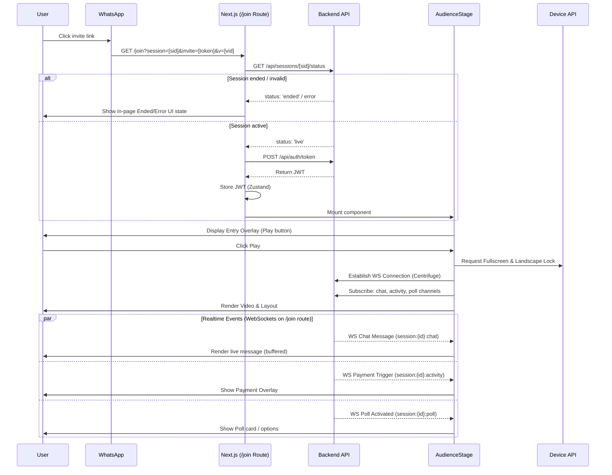

# User Flow: WhatsApp to Audience Stage

## Flow Diagram

## High Level Design (HLD)

Only two routes active: `/auth/login` and `/join`.
Entry point accepts query parameters on `/join`. App Router handles route parsing. Zustand manages client state.
API layer communicates with backend. `authApi` manages tokens. `sessionsApi` validates session state directly on `/join` page view.
Presentation layer renders UI. `AudienceStage` handles layout. `YouTubePlayer` manages video streaming. All WebSocket features (chats, payment triggers, polls) execute solely inside `/join` route under `AudienceStage`.
Device API controls viewing experience. `useFullscreenLandscape` enforces immersive mode.

## Low Level Design (LLD)

### Route Parameters
Extract `session` (string), `invite` (string), `v` (string) via `useSearchParams()` on `/join`.

### Auth & Session Check
`JoinPageContent` mount triggers API calls on `/join`.
`sessionsApi.getStatus(session)` checks session status. Returns `{ status: 'live' | 'ended' | 'scheduled' }`.
`authApi.getToken({ sessionId, inviteToken })` exchanges token. Returns `{ jwt, role, expiry }`.
`useAuthStore.setToken()` persists JWT. Updates `isLive` state. Invalid session state or expired status renders in-page Ended/Error UI within `/join` view.

### AudienceStage Lifecycle
Mount sets `hasEntered` false. Renders entry overlay on `/join` route.
User click calls `handleEnterStage()`.
Executes `enterFullscreen()` and `lockLandscape()`. Updates `hasEntered` true.
Main view renders. Container uses `flex-col md:flex-row landscape:flex-row`.
`YouTubePlayer` consumes `v` parameter.
Sidebar renders `LiveChat` or `PaymentOverlay`. `useUIStore.isChatVisible` toggles sidebar. `usePaymentStore.isPaymentOpen` toggles payment UI.

### Realtime WebSocket Orchestration on /join
WebSockets handle realtime traffic exclusively on `/join` route. Centrifuge client opens persistent connection. Enables low latency state propagation. Hook subscribes to session channels on mount.

- **Live Chat**: WS pushes chat events on `session:{id}:chat`. Hook `useLiveChat` buffers inbound message frames in plain JS ring buffer. Prevents React render thread blocking under high volume. Renders through virtualized list.
- **Payment Trigger**: WS broadcasts payment events on `session:{id}:activity`. Activity hook captures payload. Invokes transaction sheet layout. Displays `PaymentOverlay` in sidebar interface.
- **Custom Polls**: WS streams poll schemas on `session:{id}:poll`. Interaction hook updates query cache. Renders interactive survey cards. Collects viewer votes via REST response.

See [system-design.md](file:///Users/deepak/TechPix/creator-stage-frontend/docs/system-design.md) for channel topology details.

## Tech Stack

- **Framework**: Next.js 16.2.6 (React 19, Turbopack, App Router, TypeScript)
- **State Management**: Zustand 5.0.13
- **Styling**: TailwindCSS 4, Vanilla CSS
- **Data Fetching / Realtime**: TanStack React Query 5, Centrifuge 5 (realtime WebSocket client), Axios
- **Form & Validation**: React Hook Form 7, Zod 4
- **Testing**: Vitest 4, Playwright 1.59, Testing Library

## Build & Deployment Profile

Next.js Turbopack generates optimized production build. 
Pages prerendered as static content. Minimal payload.

### Performance Impact
CPU impact on ECS negligible. Static pages served directly. High concurrency supported. No SSR overhead.

## Architecture Components

### Routes
- `/auth/login`
- `/join`

### Components
- `AudienceStage`
- `JoinLoading`
- `LiveChat`
- `PaymentOverlay`
- `TriggeredDialog`
- `YouTubePlayer`
- `YoutubeIframeEmbed`
- `AuthProvider`

### Hooks
- `useFullscreenLandscape`
- `useRazorpay`

### Stores (Zustand)
- `auth-store`
- `payment-store`
- `ui-store`

### Lib & Utils
- `api-client` (Axios wrapper)
- `hmac` (Token signing)
- `razorpay` (Payment SDK loader)
- `utils` (Tailwind `cn` merge)

### APIs
- `auth` (Login, Token Exchange)
- `client` (Base configuration)
- `payments` (Order creation, Verification)
- `sessions` (Status check)
